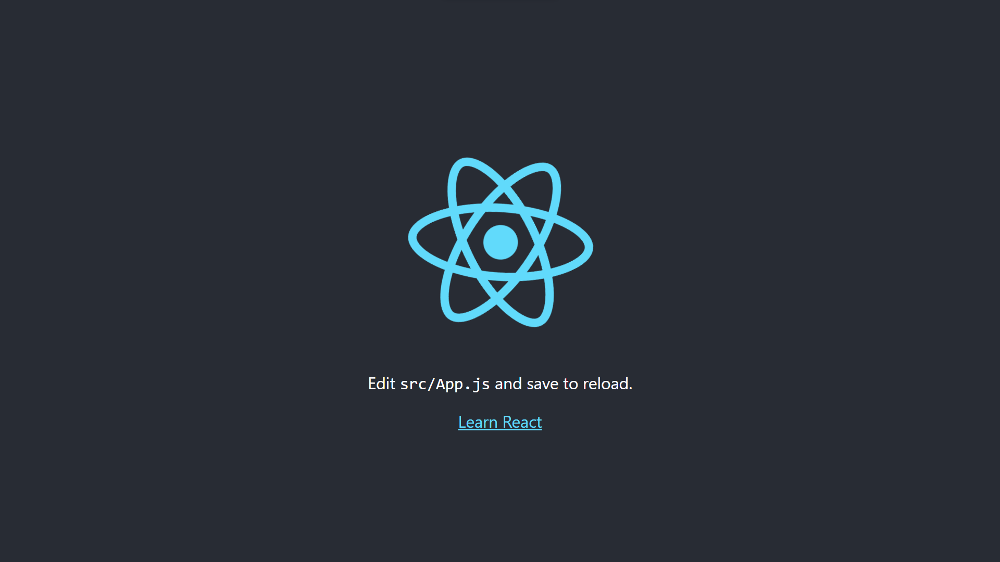

# Tutorial #1 - Instalação, criação e setup de projeto com React

## Índice

1. [Instalação](#instalação)
2. [Criação de projeto](#criação-de-projeto)
3. [Setup de projeto](#setup-de-projeto)
4. [Conclusão](#conclusão)

## Instalação

<p style='color: rgba(0,0,0,0.5);'>Obs.: Se você já tiver o Node.js instalado, e tiver checado sua instalação, pule para o 2º passo.</p>

- Baixe o Node.js no site oficial: <a href='https://nodejs.org/en/download/' target='_blank'>https://nodejs.org/en/download/</a>
  <br/>

- Istale o Node.js através do instalador para o seu sistema operacional.
  <br/>

- Cheque se a instalação foi bem sucedida através do seu terminal (windows terminal, cmd, terminal -mac, ...), digitando o comando:

```sh
node -v
npm -v
```

<br/>

- Caso o terminal retorne a versão do node e do npm, a instalação foi bem sucedida. Se não tente reiniciar sua máquina e tentar novamente.

---

## 2. Instalação do React

### 2.1. Windows

- Abra o terminal e digite o comando:

```sh
npm i -g create-react-app
```

<br/>

- Aguarde a instalação do React.
  <br/>

- Caso o terminal retorne a versão do `create-react-app`, a instalação foi bem sucedida.

### 2.2. Unix ( Linux, Mac, ... )

- Abra o terminal e digite o comando:

```sh
sudo npm i -g create-react-app
```

- Digite sua senha e aguarde a instalação do React.
  <br/>

- Cheque se a instalação foi bem sucedida através do seu terminal, digitando o comando:

```sh
create-react-app --version
```

<br/>

- Caso o terminal retorne a versão do `create-react-app`, a instalação foi bem sucedida.

---

## 3. Criação de projeto

- Abra o terminal e digite o comando:

```sh
create-react-app meu-projeto
```

- Aguarde a criação do projeto.
  <br/>

- Após a criação do projeto, entre na pasta do projeto:

```sh
cd meu-projeto
```

<br />

- Abra seu projeto no VSCode:

```sh
code .
```

- Instale as dependências do projeto:

```sh
npm install
```

<br />

- Inicie o projeto:

```sh
npm start
```

<br />

- Caso o projeto tenha sido criado com sucesso, o seu navegador padrão irá abrir no endereço `http://localhost:3000/` e você verá a tela da sua primeira aplicação React:



---

## 4. Conclusão

Neste tutorial você aprendeu a instalar o Node.js, o React e a criar seu primeiro projeto React.

Próximos passos (opicionais):

- Editar o `App.js` da aplicação criada
- Mostrar seu nome e uma foto sua na tela
- Estilizar a aplicação da forma que você quiser através do arquivo `App.css`

Caso tenha alguma dúvida, entre em contato através do Slack ou Whatsapp!
