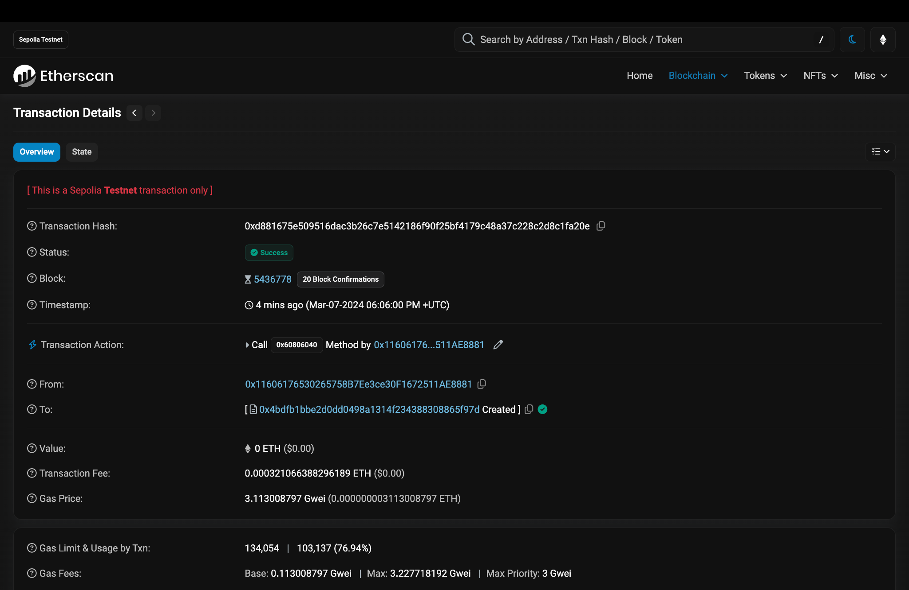

# Foundry - Deploy e Compilação de Contrato em Solidity

## Índice
- [1. Introdução](#1-introdução)
- [2. Instalação do Foundry](#2-instalação-do-foundry)
- [3. Criando um Projeto Foundry](#3-criando-um-projeto-foundry)
- [4. Introduzindo um Contrato Básico](#4-introduzindo-um-contrato-básico)
- [5. Adicionando fundos à carteira que realizará o deploy](#5-adicionando-fundos-à-carteira-que-realizará-o-deploy)
- [6. Compilação do Contrato](#6-compilação-do-contrato)
- [7. Obtendo URL RPC via Alchemy](#7-obtendo-url-rpc-via-alchemy)
- [8. Deploy do Contrato](#8-deploy-do-contrato)
  - [8.1 Configurando Variáveis de Ambiente](#81-configurando-variáveis-de-ambiente)
  - [8.2 Executando o Deploy](#82-executando-o-deploy)
- [9. Verificando o Deploy na Rede](#9-verificando-o-deploy-na-rede)
- [Autoria](#autoria)

## 1. <span id="1-introdução">Introdução</span>

Este tutorial visa explicar o processo de compilação e deploy de um smart contract utilizando Foundry, uma ferramenta moderna e eficiente para o desenvolvimento de smart contracts em Solidity.

- **Requisitos:** É necessário ter instalado o Git.
  
1. [Instalação do Git](https://git-scm.com/downloads)

## 2. <span id="2-instalação-do-foundry">Instalação do Foundry</span>

[Foundry](https://book.getfoundry.sh/getting-started/installation) é composto por duas ferramentas principais: `forge` para compilação e teste de contratos, e `cast` para interações ad-hoc com a blockchain. Para instalar o Foundry, execute:

**Utilizando zsh:**

```sh
curl -L https://foundry.paradigm.xyz | bash
foundryup
```

**Utilizando bash:**

```sh
curl -L https://foundry.paradigm.xyz | bash
bash foundryup
```

Continuando a partir da instalação do Foundry, o próximo passo é a criação de um novo projeto, introdução de um contrato básico, como um simples "Hello, World!", e então partir para as ações do Foundry de compilar, selecionar a rede, configurar o arquivo `.env` com a MNEMONIC e quaisquer outras configurações necessárias, até o deploy na rede da Sepolia.

## 3. <span id="3-criando-um-projeto-foundry">Criando um Projeto Foundry</span>

Para criar um novo projeto Foundry, execute os seguintes comandos em seu terminal:

```sh
mkdir my-foundry-project
cd my-foundry-project
forge init
```

Este comando cria uma nova pasta para o seu projeto, entra na pasta e inicializa um novo projeto Foundry, criando a estrutura de diretórios padrão.

## 4. <span id="4-introduzindo-um-contrato-básico">Introduzindo um Contrato Básico</span>

Dentro do diretório `src`, crie um novo arquivo chamado `HelloWorld.sol` e adicione o seguinte código Solidity:

```solidity
// SPDX-License-Identifier: MIT

pragma solidity ^0.8.23;
contract HelloWorld {
    function sayHello() public pure returns (string memory) {
        return "Hello, World!";
    }
}
```

Este contrato tem uma função `sayHello` que, quando chamada, retorna a string "Hello, World!".

Agora precisamos criar o script que realiza o deploy do contrato `HelloWorld`. Crie um novo arquivo chamado `HelloWorld.s.sol` na pasta `script` e adicione o seguinte código Solidity:

```solidity
// SPDX-License-Identifier: UNLICENSED

pragma solidity ^0.8.23;

import { Script, console } from "forge-std/Script.sol";
import { HelloWorld } from "../src/HelloWorld.sol";

contract HelloWorldScript is Script {
    function run() public {
        vm.startBroadcast();
        new HelloWorld();
        vm.stopBroadcast();
    }
}
```

Este script de deploy cria uma nova instância do contrato `HelloWorld` e armazena-a na variável `helloWorld`.

## 5. <span id="5-testando-o-contrato">Adicionando fundos à carteira que realizará o deploy</span>

1. Precisamos adicionar fundos à carteira que realizará o deploy do contrato. Para isso, acesse o [faucet da Sepolia](https://www.alchemy.com/faucets/ethereum-sepolia) e faça login com uma conta que desejar, pode ser Google, ou a própria Alchemy, que é a plataforma que fornecerá o URL RPC para a rede Sepolia posteriormente.


<br></br>

2. Após o login, você será redirecionado para a página de solicitação de fundos. Clique no botão "Request 1 ETH" para receber 1 ETH na sua carteira.

<br></br>

3. Após logar basta completar o captcha e clicar em "Send Me ETH".

<br></br>

4. Após clicar em "Send Me ETH", você verá uma mensagem de confirmação informando que os fundos foram enviados para a sua carteira e o link da transação para poder acompanhar o status.

<br></br>

Após algum tempo você verá que a transação foi confirmada e 0.5 ETH foram enviados para a sua carteira, e agora você pode prosseguir com o deploy do contrato.


## 6. <span id="5-compilação-do-contrato">Compilação do Contrato</span>

Para compilar o contrato, volte ao terminal e, estando na raiz do seu projeto Foundry, execute:

```sh
forge build
```

Este comando compila todos os contratos dentro do diretório `src` e gera os artefatos necessários para o deploy.


## 7. <span id="6-obtendo-url-rpc-via-alchemy">Obtendo URL RPC via Alchemy</span>

Antes de prosseguir com o deploy, você precisará de um URL RPC para a rede Sepolia, que pode ser obtido através de serviços como o Alchemy. Siga os passos abaixo para criar um novo app no Alchemy e obter o URL RPC para a rede Sepolia.

Para obter o URL RPC da rede Sepolia através do Alchemy, você precisará seguir estes passos:

1. Acesse o [site da Alchemy](https://www.alchemy.com/).
<br></br>

2. Faça login ou crie uma conta se você ainda não tem uma.

<br></br>

3. Uma vez logado, você verá o painel de controle do Alchemy.

<br></br>

4. Clique em "Create new app" para começar a configuração do seu app.

<br></br>

5. No formulário de criação de app, selecione a rede Ethereum e a rede de teste Sepolia. Dê um nome ao seu app e, se desejar, adicione uma descrição.

<br></br>

6. Depois de criar o app, você será levado para a página de visão geral do seu app, onde você pode acessar a API key e o URL RPC.

<br></br>

7. Clique no botão "API Key" para ver e copiar o URL RPC que você usará no seu projeto Foundry.

<br></br>

Agora que você tem o URL RPC, você pode prosseguir com o deploy do seu contrato na rede Sepolia.

## 8. <span id="7-deploy-do-contrato">Deploy do Contrato</span>

### 8.1 <span id="71-configurando-variáveis-de-ambiente">Configurando Variáveis de Ambiente</span>

Com o URL RPC em mãos, adicione-o ao seu arquivo `.env` juntamente com a chave privada:

```env
PRIVATE_KEY="sua_chave_privada"
RPC_URL="seu_url_rpc_sepolia_obtido_via_alchemy"
```

Lembre-se de manter suas chaves privadas seguras e nunca comitá-las em repositórios públicos.

### 8.2 <span id="72-executando-o-deploy">Executando o Deploy</span>

Para realizar o deploy, você usará um script do Foundry. Crie um arquivo de script chamado `DeployHelloWorld.s.sol` e escreva o script de deploy. Em seguida, execute o deploy usando o comando:

```sh
source .env && forge script script/DeployHelloWorld.s.sol --rpc-url $RPC_URL --private-key $PRIVATE_KEY --broadcast
```

Este comando vai compilar seu contrato e fazer o deploy na rede Sepolia.


## 9. <span id="8-verificando-o-deploy-na-rede">Verificando o Deploy na Rede</span>

Após o deploy, use a chave de API do Alchemy para verificar o status do seu contrato no [Etherscan Sepolia](https://sepolia.etherscan.io/) inserindo o endereço do contrato.



## <span id="autoria">Autoria</span>

- [Marcelo Feitoza](https://www.linkedin.com/in/marcelofeitoza7/)
- [Victor Carvalho](https://www.linkedin.com/in/victor-severiano-de-carvalho/)
