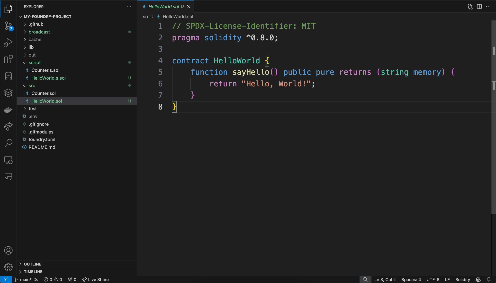
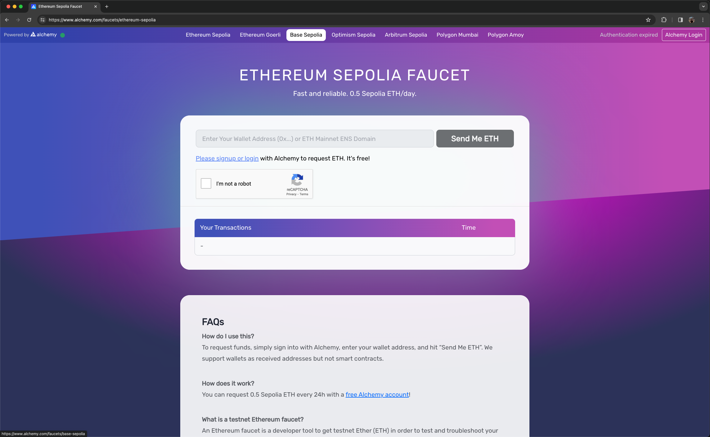

# Foundry - Deploy e Compilação de Contrato em Solidity

## Índice
1. [Introdução](#1-introdução)
    - 1.1. [Aviso Importante para Usuários do Windows](#para-usuários-do-window)
2. [Instalação do Foundry](#2-instalação-do-foundry)
3. [Criando um Projeto Foundry](#3-criando-um-projeto-foundry)
4. [Introduzindo um Contrato Básico](#4-introduzindo-um-contrato-básico)
5. [Adicionando Fundos à Carteira](#5-adicionando-fundos-à-carteira)
6. [Compilação do Contrato](#6-compilação-do-contrato)
7. [Obtendo URL RPC via Alchemy](#7-obtendo-url-rpc-via-alchemy)
8. [Configurando Variáveis de Ambiente](#8-configurando-variáveis-de-ambiente)
9. [Deploy do Contrato](#9-deploy-do-contrato)
    - 9.1. [Executando o Deploy](#91-executando-o-deploy)
10. [Verificando o Deploy na Rede](#10-verificando-o-deploy-na-rede)
11. [Testando o Contrato Deployado](#11-testando-o-contrato-deployado)
    - 11.1. [Interagindo com o Contrato](#111-interagindo-com-o-contrato)
    - 11.2. [Decodificando a Resposta](#112-decodificando-a-resposta)
12. [Autoria](#autoria)

---


## <span id="1-introdução">1. Introdução</span>

Bem-vindo ao tutorial sobre compilação e deploy de smart contracts utilizando a Foundry. Foundry é uma poderosa suíte de ferramentas de desenvolvimento para a Ethereum, projetada para oferecer eficiência e simplicidade para desenvolvedores de blockchain. Neste guia, vamos explorar como instalar o Foundry, criar um novo projeto, escrever um contrato simples em Solidity, e finalmente, deployá-lo na rede de testes Sepolia.

O tutorial está estruturado para desenvolvedores que estão confortáveis com a linha de comando e têm um entendimento básico de como smart contracts funcionam. Vamos começar do início com a instalação e configuração da Foundry e avançar passo a passo até o deploy e teste do contrato.

Para aproveitar ao máximo este tutorial, você precisa ter o seguinte:

- Conhecimento básico de Solidity e desenvolvimento de smart contracts.
- Um ambiente de desenvolvimento UNIX-like, como Linux ou macOS. Usuários do Windows precisarão do Windows Subsystem for Linux (WSL) instalado e configurado.

Prepare-se para configurar o ambiente de desenvolvimento, escrever o código Solidity, testar, e finalmente, fazer o deploy de seu contrato na rede blockchain. Vamos começar essa jornada empolgante no mundo do desenvolvimento Ethereum.

### <span id="para-usuários-do-window">1.1. Para usuários do Windows:</span>

> :warning: **AVISO IMPORTANTE PARA USUÁRIOS DO WINDOWS:** 
> Este tutorial foi elaborado com foco em usuários de sistemas operacionais UNIX, como Linux e macOS. Usuários do Windows podem encontrar dificuldades em seguir as instruções aqui apresentadas, devido às diferenças nos comandos e estruturas de diretórios.
> 
> É um requisito obrigatório o uso do Windows Subsystem for Linux (WSL), que permite a execução de um ambiente GNU/> Linux diretamente no Windows. Para instalar e configurar o WSL em seu sistema, recomendamos que siga o tutorial > em vídeo disponibilizado pela [hcode no YouTube](https://www.youtube.com/watch?v=_Wp2nWtTBBY&ab_channel=hcode) > que oferece uma visão prática e detalhada do processo de instalação:

<iframe width="560" height="315" src="https://www.youtube.com/embed/_Wp2nWtTBBY" title="YouTube video player" > frameborder="0" allow="accelerometer; autoplay; clipboard-write; encrypted-media; gyroscope; picture-in-picture" > allowfullscreen></iframe>

> 
> Além disso, para uma compreensão mais aprofundada e passos adicionais de instalação, consulte a [documentação > oficial da Microsoft sobre o WSL](https://learn.microsoft.com/pt-br/windows/wsl/install). Também é recomendável a > leitura do artigo "[Primeiros passos com WSL](https://dev.to/feministech/primeiros-passos-com-wsl-fk1)" para um > guia introdutório ao ambiente Linux no Windows.
> 
> Tenha em mente que o desempenho e a experiência podem variar, e que é importante garantir que o WSL esteja > atualizado e configurado corretamente antes de prosseguir com o tutorial.

---

## 2. <span id="2-instalação-do-foundry">Instalação do Foundry</span>

[Foundry](https://book.getfoundry.sh/getting-started/installation) é composto por duas ferramentas principais: `forge` para compilação e teste de contratos, e `cast` para interações ad-hoc com a blockchain. Para instalar o Foundry, execute:

```sh
curl -L https://foundry.paradigm.xyz | bash
```

2. Rodar bash para atualizar seu sistema:
```
bash
```

3. Após a conclusão do download, execute o comando abaixo para atualizar o Foundry para a versão mais recente:

```sh
foundryup
```

**Utilizando bash:**

```sh
curl -L https://foundry.paradigm.xyz | bash
bash
foundryup
```


Este processo instalará as ferramentas necessárias do Foundry em seu sistema, e você estará pronto para criar e desenvolver contratos inteligentes Solidity. Lembre-se de que, se estiver usando Windows, você deve fazer isso dentro do WSL para compatibilidade total.

### Pós-instalação:

Após instalar o Foundry, você pode começar a criar seu projeto Solidity. O próximo passo será configurar um novo projeto e introduzir um contrato básico, como "Hello, World!", e então avançar para compilar o contrato e preparar o ambiente para o deploy na rede Sepolia.

Lembre-se de que as imagens e os exemplos de código devem ser revisados para garantir que estão corretos e representam com precisão as etapas descritas.

---

## 3. <span id="3-criando-um-projeto-foundry">Criando um Projeto Foundry</span>

Para começar a usar o Foundry e desenvolver seus próprios contratos inteligentes, você precisará criar um novo projeto. O Foundry facilita este processo com um comando simples.

### Passos para criar um novo projeto Foundry:

1. Abra o terminal no seu sistema operacional UNIX (macOS ou Linux) ou WSL no Windows.

2. Navegue até o diretório onde deseja criar o seu novo projeto.

3. Execute os comandos a seguir para criar um diretório para o seu projeto e inicializá-lo com a estrutura padrão do Foundry:

```sh
mkdir my-foundry-project
cd my-foundry-project
forge init
```

Esses comandos criam uma nova pasta chamada `my-foundry-project`, entram nessa pasta e executam o comando `forge init` para iniciar um novo projeto Foundry. Isso cria a estrutura de diretórios padrão do Foundry, que inclui diretórios para contratos, scripts e testes, bem como arquivos de configuração inicial.

### Após a criação do projeto:

Depois que seu projeto Foundry for criado, você encontrará dentro da pasta do projeto:

- Uma pasta `src` para armazenar seus contratos inteligentes Solidity.
- Uma pasta `test` para os testes de seus contratos.
- Uma pasta `script` para os scripts de deploy e interações com a blockchain.
- Um arquivo de configuração chamado `foundry.toml`, onde você pode personalizar várias configurações do seu projeto.

Você agora está pronto para começar a desenvolver seu contrato inteligente dentro do ecossistema Foundry.


A imagem e os comandos fornecidos são exemplos e devem ser adequados às suas necessidades específicas e verificados para precisão.

---

## 4. <span id="4-introduzindo-um-contrato-básico">Introduzindo um Contrato Básico</span>

Após a criação do seu projeto Foundry, o próximo passo é escrever seu primeiro contrato inteligente. Vamos começar com algo simples, um contrato que retorna "Hello, World!".

### Criação do Contrato `HelloWorld.sol`:

1. No diretório do projeto, navegue até a pasta `src`.

2. Crie um novo arquivo Solidity chamado `HelloWorld.sol`:

```sh
touch src/HelloWorld.sol
```

3. Abra o arquivo `HelloWorld.sol` em seu editor de código favorito.

4. Escreva o seguinte código Solidity no arquivo:

```solidity
// SPDX-License-Identifier: MIT
pragma solidity ^0.8.23;

contract HelloWorld {
    function sayHello() public pure returns (string memory) {
        return "Hello, World!";
    }
}
```

### Explicação do Código:

- `// SPDX-License-Identifier: MIT`: Uma licença para o código, aqui usamos a licença MIT.
- `pragma solidity ^0.8.23;`: Especifica a versão do compilador Solidity que seu contrato requer.
- `contract HelloWorld { ... }`: Declaração do contrato chamado `HelloWorld`.
- `function sayHello() public pure returns (string memory) { ... }`: Uma função pública `sayHello` que não altera o estado no blockchain e retorna uma string.

### O que acontece ao executar a função:

Quando alguém chama a função `sayHello`, ela retorna a string "Hello, World!". É uma função `pure` porque não modifica nem lê o estado do blockchain.

### Testando seu contrato:

Antes de implantar o contrato na blockchain, você pode testar sua função localmente usando as ferramentas do Foundry. Certifique-se de que tudo está funcionando conforme esperado antes de prosseguir para a próxima etapa.



A imagem e os códigos fornecidos são exemplos e devem ser verificados para precisão e segurança antes do uso.

A seção que você forneceu já está bem elaborada e clara, explicando como adicionar fundos à carteira para o deploy do contrato. Aqui está uma revisão leve para garantir que está polido e pronto para ser parte do seu tutorial:

---

## 5. <span id="5-adicionando-fundos-à-carteira">Adicionando Fundos à Carteira</span>

Antes de prosseguir com o deploy do contrato na rede Sepolia, é necessário garantir que a carteira que você usará tenha fundos suficientes para cobrir o custo do gás. Para isso, você pode utilizar o faucet da Sepolia fornecido pela Alchemy, que permite solicitar Ether (ETH) de teste gratuitamente.

### Como adicionar fundos:

1. **Acesse o Faucet da Sepolia:**
Visite o [faucet da Sepolia](https://www.alchemy.com/faucets/ethereum-sepolia) oferecido pela Alchemy. Você pode logar usando uma conta do Google ou criar uma nova conta na Alchemy.
    
<br></br>

2. **Solicite o ETH de teste:**
Após efetuar o login, você será redirecionado para a página onde pode solicitar o ETH. Clique no botão "Request 1 ETH" para adicionar fundos à sua carteira.
    
<br></br>

3. **Complete o Captcha e envie a solicitação:**
Preencha o captcha necessário e clique em "Send Me ETH" para confirmar sua solicitação.
    
<br></br>

4. **Confirmação e acompanhamento:**
Uma mensagem de confirmação será exibida, e um link para o Etherscan permitirá que você acompanhe o status da transação. Em breve, 0.5 ETH serão adicionados à sua carteira.
    

Após a confirmação da transação, sua carteira estará financiada com ETH suficiente para realizar o deploy do contrato na rede Sepolia.


Este passo é crucial para assegurar que você possa cobrir os custos associados ao deploy do contrato, permitindo que você prossiga com o processo sem interrupções.

---

## 6. <span id="6-compilação-do-contrato">Compilação do Contrato</span>

Após desenvolver seu contrato inteligente em Solidity, o próximo passo antes de realizar o deploy é compilar o contrato para garantir que está livre de erros e pronto para ser executado na EVM (Ethereum Virtual Machine).

### Utilizando o Foundry para Compilar

O Foundry fornece uma ferramenta chamada `forge` que simplifica o processo de compilação de contratos inteligentes Solidity. Veja como usar:

1. **Abra o terminal** no diretório do seu projeto Foundry.

2. **Execute o comando de compilação:**

```sh
forge build
```

Este comando analisa todos os arquivos Solidity no diretório `src` e compila os contratos. Se houver algum erro no contrato, ele será exibido no terminal, permitindo que você faça as correções necessárias.

### Resultado da Compilação

Após a compilação ser bem-sucedida, o `forge` gera artefatos de compilação, incluindo os bytecodes dos contratos e as Interfaces Binárias de Aplicação (ABI), que são essenciais para interagir com os contratos na blockchain. Esses artefatos são geralmente armazenados no diretório `out`.


### Verificação de Erros

- Caso encontre erros durante a compilação, revise seu código Solidity para correções. Erros comuns podem incluir problemas de sintaxe, funções mal definidas ou incompatibilidades de versão do compilador Solidity.
- Utilize as mensagens de erro como guia para identificar e corrigir os problemas no seu contrato.

### Próximos Passos

Com o contrato compilado sem erros, você está pronto para prosseguir para a etapa de deploy. A compilação bem-sucedida é um indicativo de que o contrato está sintaticamente correto e pronto para ser testado ou implantado na rede Ethereum.

Lembre-se de que a compilação é uma etapa crucial no desenvolvimento de contratos inteligentes, pois garante que o código está pronto para ser usado na blockchain sem problemas de execução.

---

## 7. <span id="7-obtendo-url-rpc-via-alchemy">Obtendo URL RPC via Alchemy</span>

Antes de realizar o deploy do seu contrato na rede Sepolia, é essencial obter um URL RPC (Remote Procedure Call). Esse URL é necessário para se conectar à rede blockchain e pode ser adquirido por meio de serviços como o Alchemy, que oferece acesso fácil a endpoints RPC.

### Como obter o URL RPC com Alchemy:

1. **Acesse a Alchemy:**
Visite o site da Alchemy em [https://www.alchemy.com/](https://www.alchemy.com/) e proceda para o próximo passo.
   

2. **Faça login ou crie uma nova conta:**
Se você ainda não possui uma conta na Alchemy, crie uma seguindo as instruções na tela. Se já tem, faça login com suas credenciais.
    

3. **Crie um novo app na Alchemy:**
No painel de controle, procure e clique no botão "Create new app". Isso iniciará o processo para configurar um novo endpoint RPC.
    

4. **Configure seu app:**
Preencha o formulário de criação do app. Selecione "Ethereum" como a rede e escolha "Sepolia" como a rede de teste. Insira um nome para o seu app e, opcionalmente, uma descrição.
    

5. **Acesse sua API Key e o URL RPC:**
Após criar o app, você será redirecionado para a página de visão geral, onde poderá encontrar a chave da API e o URL RPC. Esses dados serão usados para se conectar à rede Sepolia durante o deploy do contrato.
   

6. **Copie o URL RPC:**
Clique no botão "API Key" para visualizar e copiar o URL RPC necessário para seu projeto Foundry.
    

Com o URL RPC em mãos, você está pronto para configurar o ambiente do seu projeto Foundry e prosseguir para o deploy do contrato na rede Sepolia. Este passo é crucial para garantir que sua aplicação se comunique corretamente com a blockchain.

---

## 8. <span id="8-configurando-variáveis-de-ambiente">Configurando Variáveis de Ambiente</span>

Antes de realizar o deploy do seu contrato, é fundamental configurar as variáveis de ambiente que serão utilizadas pelo Foundry. Isso inclui especificar a chave privada da carteira que fará o deploy e o URL RPC obtido no passo anterior.

### Preparando o arquivo `.env`:

1. **Crie um arquivo `.env`:**
   - No diretório raiz do seu projeto Foundry, crie um arquivo chamado `.env` para armazenar suas variáveis de ambiente de forma segura.

```sh
touch .env
```

2. **Adicione suas variáveis ao arquivo `.env`:**
   - Abra o arquivo `.env` criado e adicione as seguintes linhas, substituindo `your_private_key` pela chave privada da sua carteira Ethereum e `your_rpc_url` pelo URL RPC que você copiou do Alchemy:

```env
export PRIVATE_KEY=your_private_key
export RPC_URL=your_rpc_url
```

### Importante:

- **Segurança da Chave Privada:** Tenha extremo cuidado com a chave privada da sua carteira. Nunca compartilhe com ninguém e não a exponha em repositórios públicos. Considere usar variáveis de ambiente para mantê-la segura.
- **Uso do arquivo `.env` para configuração:** Utilizar um arquivo `.env` ajuda a manter suas credenciais seguras e fora do seu código-fonte, facilitando a configuração sem comprometer a segurança.

### Utilizando as variáveis de ambiente:

Quando for realizar o deploy do contrato ou interagir com a blockchain, você pode carregar as variáveis de ambiente automaticamente usando o comando `source`:

```sh
source .env
```

Isso tornará `PRIVATE_KEY` e `RPC_URL` disponíveis para os comandos subsequentes no seu terminal.

### Próximos Passos:

Com as variáveis de ambiente devidamente configuradas, você está pronto para prosseguir para o deploy do seu contrato na rede Sepolia. Este passo é essencial para garantir que a interação com a blockchain seja segura e eficaz.


Agora que as variáveis de ambiente estão configuradas, o próximo passo é utilizar o Foundry para realizar o deploy do seu contrato inteligente na rede Sepolia, utilizando as credenciais e o URL RPC definidos.

---

## 9. <span id="9-deploy-do-contrato">Deploy do Contrato</span>

Após configurar suas variáveis de ambiente, o próximo passo é o deploy do seu contrato inteligente na rede Sepolia. O Foundry facilita esse processo com o uso do comando `forge`.

### 9.1 <span id="91-executando-o-deploy">Executando o Deploy</span>

Para realizar o deploy do seu contrato, siga estas etapas:

1. **Certifique-se de que suas variáveis de ambiente estão carregadas:**

Antes de executar o deploy, carregue as variáveis de ambiente definidas no arquivo `.env` para garantir que o `forge` tenha acesso à sua chave privada e ao URL RPC da Sepolia.

```sh
source .env
```

2. **Prepare o script de deploy:**

Crie um script de deploy na pasta `script` do seu projeto Foundry, se ainda não tiver feito. Este script deve especificar qual contrato você deseja deployar e com quais parâmetros. Vamos assumir que você já tenha um script chamado `DeployHelloWorld.s.sol`.

3. **Execute o comando de deploy:**

Utilize o comando `forge script` para executar seu script de deploy, especificando o URL RPC e a chave privada diretamente ou através das variáveis de ambiente carregadas.

```sh
forge script script/DeployHelloWorld.s.sol --rpc-url $RPC_URL --private-key $PRIVATE_KEY --broadcast
```

Este comando compilará seu contrato (se necessário), fará o deploy na rede Sepolia e retornará o endereço do contrato deployado.

### O que esperar:

- **Transação de Deploy:** O comando acima envia uma transação de deploy para a rede Sepolia. Isso pode levar alguns segundos a minutos, dependendo da congestão da rede.
- **Endereço do Contrato:** Após o sucesso do deploy, o terminal exibirá o endereço do contrato deployado na rede Sepolia. Anote este endereço para futuras interações com seu contrato.

### Verificando o Deploy:

Você pode verificar o deploy do seu contrato acessando o [Sepolia Etherscan](https://sepolia.etherscan.io/) e buscando pelo endereço do contrato. Lá, você poderá ver detalhes da transação de deploy e interagir com o contrato através da interface do Etherscan.


### Próximos Passos:

Após o deploy do contrato, você pode querer verificar se tudo está funcionando como esperado na rede. Para isso, você pode interagir com o contrato usando ferramentas do Foundry, como o `cast`, ou diretamente através do Etherscan, caso tenha habilitado funções de leitura/escrita na interface do usuário.

O deploy bem-sucedido do seu contrato é um marco importante no desenvolvimento de aplicativos descentralizados. A partir daqui, você pode começar a integrar seu contrato com interfaces de usuário, outros contratos e sistemas.

---

## 10. <span id="10-verificando-o-deploy-na-rede">Verificando o Deploy na Rede</span>

Após realizar o deploy do seu contrato inteligente, é crucial verificar se ele foi implantado corretamente e está funcionando na rede Sepolia. Isso inclui confirmar o deploy através do Etherscan da rede Sepolia e interagir com o contrato para testar suas funções.

### 10.1 <span id="101-encontre-o-endereço-do-contrato-deployado">Encontre o Endereço do Contrato Deployado</span>

1. **Encontre o Endereço do Contrato Deployado:**
   - Após o deploy, o Foundry irá fornecer o endereço do contrato implantado. Copie este endereço para uso posterior.

2. **Visite o Etherscan da Sepolia:**
   - Abra seu navegador e acesse [Sepolia Etherscan](https://sepolia.etherscan.io/). 

3. **Busque pelo Seu Contrato:**
   - Na barra de busca do Etherscan, cole o endereço do seu contrato e pressione Enter. Você será direcionado para a página do seu contrato.

### <span id="102-verifique-o-contrato-no-etherscan">10.2 Verifique o Contrato no Etherscan</span>

Na página do contrato no Etherscan da Sepolia, você pode verificar várias informações importantes:

- **Transações:** Veja todas as transações relacionadas ao seu contrato, incluindo a transação de deploy.
- **Código do Contrato:** Se você verificou o código fonte do seu contrato, poderá visualizá-lo aqui.
- **Leitura e Escrita:** Algumas funções do contrato podem ser testadas diretamente do Etherscan, se forem funções de leitura pública ou se você tiver uma carteira conectada para funções de escrita.

### <span id="103-interagindo-com-o-contrato">10.3 Interagindo com o Contrato</span>

Para testar a funcionalidade do seu contrato, você pode utilizar ferramentas como o `cast` do Foundry para realizar chamadas de leitura ou escrita. Alternativamente, se o contrato tiver sido verificado, você pode usar a interface do Etherscan para interagir com ele.

- **Testando Funções de Leitura:**
  Se o seu contrato tiver funções de leitura (como a função `sayHello` do exemplo `HelloWorld`), você pode testá-las diretamente no Etherscan ou utilizando o `cast`:

  ```sh
  cast call <endereço_do_contrato> "sayHello()" --rpc-url $RPC_URL
  ```

Substitua `<endereço_do_contrato>` pelo endereço real do seu contrato deployado e `$RPC_URL` pela sua URL RPC.


### Conclusão

Verificar o deploy do seu contrato na rede Sepolia é um passo essencial para garantir que tudo está funcionando conforme esperado. Isso prepara o terreno para a próxima fase do desenvolvimento do seu projeto, que pode incluir a integração do contrato com uma interface de usuário ou a realização de testes mais aprofundados.

Lembre-se de que a segurança e a funcionalidade correta do seu contrato são fundamentais. Portanto, certifique-se de realizar testes exaustivos e considerar a auditoria do código por profissionais, especialmente se o contrato for utilizado em produção ou gerenciar ativos de valor.

---

## 11. Testando o Contrato Deployado

Depois de verificar que seu contrato foi implantado corretamente na rede Sepolia, o próximo passo é testar suas funcionalidades para garantir que tudo está operando como esperado. O Foundry fornece ferramentas úteis como `cast` para facilitar a interação e o teste de contratos inteligentes.

### 11.1 Interagindo com o Contrato

Para interagir com seu contrato, você usará o comando `cast` do Foundry. O `cast` permite que você faça chamadas de leitura e escrita para contratos inteligentes de maneira simples e direta.

#### Exemplo de Chamada de Leitura:

Supondo que seu contrato `HelloWorld` tenha uma função `sayHello()` que retorna "Hello, World!", você pode testá-la com o seguinte comando:

```sh
cast call <endereço_do_contrato> "sayHello()" --rpc-url $RPC_URL
```

Substitua `<endereço_do_contrato>` pelo endereço real do seu contrato deployado. Certifique-se de que a variável `$RPC_URL` esteja definida com o URL RPC da Sepolia que você obteve anteriormente.


#### Verificando a Resposta:

Se a função `sayHello()` estiver funcionando corretamente, o comando `cast call` retornará a string "Hello, World!" codificada em hexadecimal. Você pode usar ferramentas online ou comandos de terminal para decodificar essa resposta e verificar o resultado.

### 11.2 Decodificando a Resposta

Após realizar uma chamada de leitura ao seu contrato, você pode receber a resposta em formato hexadecimal. Para decodificar essa resposta e visualizar a mensagem legível, você pode usar o comando `xxd` ou ferramentas online de decodificação de hex para texto.

#### Exemplo de Decodificação com `xxd`:

Suponha que a resposta do comando `cast call` seja:

```
0x0000000000000000000000000000000000000000000000000000000000000020000000000000000000000000000000000000000000000000000000000000000d48656c6c6f2c20576f726c642100000000000000000000000000000000000000
```

Você pode decodificar essa resposta usando `xxd` da seguinte forma:

```sh
source .env && forge script script/DeployHelloWorld.s.sol --rpc-url $RPC_URL --private-key $PRIVATE_KEY --broadcast
```

Este comando vai compilar seu contrato e fazer o deploy na rede Sepolia.


## Autoria

Este documento foi criado por:

- [Marcelo Feitoza](https://www.linkedin.com/in/marcelofeitoza7/)
- [Victor Carvalho](https://www.linkedin.com/in/victor-severiano-de-carvalho/)
