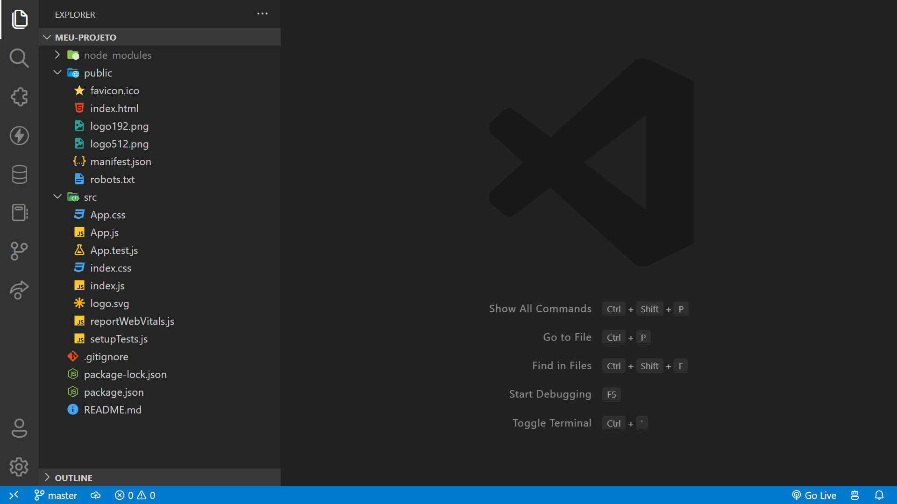
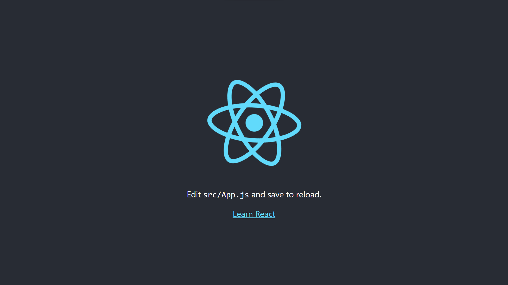

# React - Instalação e criação do primeiro projeto

## Índice

1. [Instalação do Node.js](#1-instalação-do-nodejs)
2. [Instalação do React](#2-instalação-do-react)
3. [Criação de projeto](#3-criação-de-projeto)
4. [Conclusão](#4-conclusão)
5. [Autoria](#autoria)

## <p id="instalação">1. Instalação do Node.js</p>
<p style='color: rgba(0,0,0,0.5);'>Obs.: Se você já tiver o Node.js instalado, e tiver checado sua instalação, pule para o 2º passo.</p>

### O que é o Node.js?

O Node.js é uma maneira de executar JavaScript fora do navegador. Ele é um ambiente de execução JavaScript assíncrono com código aberto orientado a eventos. Em outras palavras, ele é um ambiente de execução JavaScript construído em cima do motor JavaScript do Google Chrome, porém capaz de executar códigos JavaScript fora do navegador.

### Instalação

- Baixe o Node.js no site oficial: <a href='https://nodejs.org/en/download/' target='_blank'>https://nodejs.org/en/download/</a>
<br />

- Instale o Node.js através do instalador para o seu sistema operacional.
<br />

- Cheque se a instalação foi bem sucedida através do seu terminal (windows terminal, cmd, terminal -mac, ...), digitando o comando:

```sh
node -v
npm -v
```
<br />

- Caso o terminal retorne a versão do node e do npm, a instalação foi bem sucedida. Se não você pode tentar reiniciar seu terminal, e em último caso, reiniciar seu computador.

---

## <p id="instalação-react">2. Instalação do React</p>

### O que é o React?

O React é uma biblioteca JavaScript com foco em criar interfaces de usuário em páginas web. Foi criado e é mantido pelo Facebook e comunidades de desenvolvedores individuais e empresas que contribuem com a biblioteca. É usado na produção do Facebook, Instagram e outras aplicações web.

Dentre as principais características do React estão:

<div style="width: 100%; display: flex; justify-content: space-between;">

<div style="display: flex; flex-direction: column; width: 50%;">

**Componentes**: O React é baseado em componentes, que são blocos de código que podem ser reutilizados dinamicamente através das interfaces. Um componente é uma função que aceita entradas (chamadas de "props") e retorna um elemento que descreve como uma parte da interface de usuário deve aparecer.

</div>

<div style="display: flex; flex-direction: column; width: 50%;">

**JSX**: O React usa uma extensão de sintaxe para JavaScript chamada JSX que permite que você escreva HTML diretamente dentro do JavaScript. JSX torna o React mais legível, e você pode usar HTML e JavaScript juntos no mesmo arquivo.

</div>

</div>

### Instalação

Para instalar o React tanto no Windows quanto em sistemas Unix utilizaremos o npm, instalado no passo anterior.

#### 2.1. Windows

- Abra o terminal e digite o comando:

```sh
npm i -g create-react-app
```
<br/>

- Aguarde a instalação do React.
<br/>

- Cheque se a instalação foi bem sucedida através do seu terminal, digitando o comando:
```sh 
create-react-app --version
```
<br/>

- Caso o terminal retorne a versão do `create-react-app`, a instalação foi bem sucedida.

#### 2.2. Unix ( Linux, Mac, ... )

- Abra o terminal e digite o comando:

```sh
sudo npm i -g create-react-app
```
<br/>

- Digite sua senha e aguarde a instalação do React.
<br/>

- Cheque se a instalação foi bem sucedida através do seu terminal, digitando o comando:

```sh
create-react-app --version
```
<br/>

- Caso o terminal retorne a versão do `create-react-app`, a instalação foi bem sucedida.

---

## <p id="criação-de-projeto">3. Criação de projeto</p>

- Abra o terminal e digite o comando:

```sh
create-react-app meu-projeto
```
<br/>


- Aguarde a criação do projeto.
<br/>

- Após a criação do projeto, entre na pasta do projeto:

```sh
cd meu-projeto
```
<br/>

- Ao entrar nessa pasta você verá essa estrutura de pastas e arquivos:

<br />

- - Essas pastas e arquivos são os arquivos e pastas padrões de um projeto React. Vamos entender cada um deles:

- - - <div><h5>public</h5>Essa pasta contém o arquivo `index.html` que é a página principal do projeto, onde está a div com o id `root`, que é onde o React irá renderizar todo o código.</div>

- - - <div><h5>src</h5>Essa pasta contém todos os arquivos do projeto, e é nela que criamos nossos componentes, páginas, rotas, etc</div>
- - - - <div><h6>App.js</h6>Esse arquivo é o componente principal do projeto, onde é renderizado o componente `Routes`.</div>
- - - - <div><h6>index.js</h6>Esse arquivo é o arquivo principal do projeto, onde é renderizado o componente `App` no arquivo `index.html` na pasta public.</div>
- - - - <div><h6>App.css e index.css</h6>Esses arquivos são os arquivos de estilos do projeto.</div>
<p style="opacity: 0.5;">Obs.: Os demais arquivos são arquivos padrões do projeto React, podendo ser removidos.</p>
<br/>


- Para continuar, vamos abrir o projeto no VSCode:

```sh
code .
```
<br/>

- Instalar as dependências do projeto:

```sh
npm install
```
<br/>


- E iniciar o projeto:

```sh
npm start
```
<br/>


- Caso o projeto tenha sido criado com sucesso, o seu navegador padrão irá abrir no endereço <a href="http://localhost:3000/" target='_blank'>http://localhost:3000/</a> e você verá a tela da sua primeira aplicação React:



---

## <p id="conclusão">4. Conclusão</p>

Neste tutorial você aprendeu a instalar o Node.js, o React e a criar seu primeiro projeto React.

Próximos passos para aprendizado com o projeto criado:

- Editar o `App.js` da aplicação criada
- Mostrar seu nome e uma foto sua na tela
- Estilizar a aplicação da forma que você quiser através do arquivo `App.css`

Caso tenha alguma dúvida, entre em contato através do Slack ou Whatsapp!

## <span id="autoria">Autoria</span>

Marcelo Feitoza - Autor
Contato: [www.linkedin.com/in/marcelofeitoza7](https://www.linkedin.com/in/marcelofeitoza7/)

Victor Severiano de Carvalho - Revisor
Contato: [www.linkedin.com/in/victor-severiano-de-carvalho-b57a05237](http://www.linkedin.com/in/victor-severiano-de-carvalho-b57a05237)