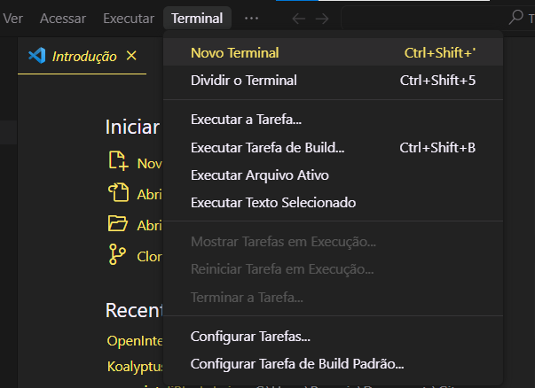

# Truffle - Deploy e compilação de contrato em Solidity

## Índice
- [1. Introdução](#1-introdução)
- [2. Instalação do Truffle](#2-instalação-do-truffle)
- [3. Compilação do contrato](#3-compilação-do-contrato)
- - [3.1 Informando qual o contrato](#31-informando-qual-o-contrato)
- - [3.2 Selecionando a rede](#32-selecionando-a-rede)
- [4. Instalação do ".env"](#4-instação-do-dotenv)
- - [4.1 Criando o arquivo ".env"](#41-criando-o-arquivo-env)
- - [4.2 Colocando o ".env" no ".gitignore"](#42-colocando-o-env-no-gitignore)	
- [5. Pegando a MNEMONIC da Metamask e a API KEY do Infura](#5-pegando-a-mnemonic-da-metamask-e-a-api-key-do-infura)
- - [5.1 Seed Phrase da Metamask](#51-seed-phrase-da-metamask)
- - [5.2 API KEY do Infura](#52-api-key-do-infura)
- [6. Deploy do contrato](#6-deploy-do-contrato)
- - [6.1 Colocando "dinheiro" na conta](#61-colocando-dinheiro-na-sua-conta)
- - [6.2 Deploy](#62-deploy)
- [Autoria](#autoria)


## 1. <span id="1-introdução">Introdução</span>

Neste tutorial será explicado todo o processo de deploy de um smart contract utilizando a biblioteca Truffle

- Requisitos: NodeJS, Git e VSCode instalados

Primeiramente, é necessário criar uma nova pasta ou abrir uma pasta já existente do projeto que deseja fazer o deploy. Depois disso, abra o cmd na sua máquina e direcione-se à pasta que foi aberta ou abra um novo terminal em seu VSCode(Ctrl + Shift + ‘).



Observação: Caso opte por abrir o terminal no VSCode, esteja ciente que ele precisa ser um terminal “Command Prompt”, pois em alguns passos do tutorial existe uma limitação de alguns comandos para terminais como PowerShell. Para checar e alterar caso necessário, siga a seguinte instrução:


## 2. <span id="2-instalação-do-truffle">Instalação do Truffle</span>

Agora sim, vamos efetivamente começar a diversão. No seu terminal, escreva o seguinte comando para instalar a biblioteca do Truffle globalmente (para isso a função -g):

*Caso já possua ela instalada, pule para a próxima etapa.

```jsx
npm install -g truffle
```

Depois de instalada, o comando a seguir permite visualizar a versão da biblioteca instalada:

```jsx
truffle --version
```

É possível ver que a biblioteca foi instalada. Agora, inicie o truffle em seu repositório por meio do seguinte comando no terminal:

```jsx
truffle init
```

Note que algumas pastas foram criadas. Uma das pastas é a “contracts”, a qual deve possuir o seu contrato com a extensão “.sol”. Caso ele já exista, basta arrastar ele para a pasta, caso não exista,  crie seu arquivo no interior dessa pasta.

Outra pasta criada foi a “migrations”. Dentro dela, crie um arquivo “.js”(JavaScript). O nome desse arquivo precisa iniciar com uma numeração ordenada começando em 1 acompanhada de um “_”(exemplo: 1_deployContract.js) para que seja executado em ordem por convenções da biblioteca.


Agora, volte para o terminal e execute o seguinte comando para criar um pacote que cria o arquivo “package.json”, pulando a parte de configuração do package(para isso a função -y).

```jsx
npm init -y
```

Caso precise instalar bibliotecas, agora é o momento perfeito para que elas sejam inclusas nas dependências do pacote.

```jsx
npm install @openzeppelin/contracts
```

## 3. <span id="3-compilação-do-contrato">Compilação do Contrato</span>

Depois de instalar as bibliotecas, execute o seguinte comando no terminal para compilar o contrato:

```jsx
truffle compile
```

Caso a compilação tenha sido feita com sucesso, em um código sem erros, a pasta build deve aparecer. Essa pasta tem a função de criar uma interface que pega a ABI do contrato e traduz para JavaScript, para que o contrato seja entendido e deployado na Blockchain.

**Observação**: Uma interface binária de aplicação (ou ABI, do inglês application binary interface) descreve a interface de baixo nível entre uma aplicação e o sistema operacional, entre a aplicação e suas bibliotecas ou entre componentes de uma aplicação.

### 3.1 <span id="31-informando-qual-o-contrato">Informando qual o contrato</span>

Agora, volte no arquivo “.js” criado na pasta “migrations” e escreva o seguinte código para informar o contrato que deseja compilar e fazer deploy:

```jsx
const contrato = artifacts.require("nomeContrato");

module.exports = function(deployer) {
    // deployment steps
    deployer.deploy(contrato);
  };
```

************************IMPORTANTE:************************ Em ‘nomeContrato’, estamos nos referindo não ao nome do arquivo, mas, sim, ao nome que acompanha a palavra-chave “contract” dentro do arquivo “.sol”.

### 3.2 <span id="32-selecionando-a-rede">Selecionando a rede</span>

Depois de informar qual contrato desejamos, é preciso selecionar a rede na qual o deploy será feito. Para isso, vá no arquivo “truffle-config.js”, criado com o comando “npm install truffle” anteriormente, procure na linha 85 a testnet “goerli” e descomente a mesma até a chave (“}”) na linha 91, que fecha o objeto.

```jsx
goerli: {
      provider: () => new HDWalletProvider(MNEMONIC, `https://goerli.infura.io/v3/${PROJECT_ID}`),
      network_id: 5,       // Goerli's id
      confirmations: 2,    // # of confirmations to wait between deployments. (default: 0)
      timeoutBlocks: 200,  // # of blocks before a deployment times out  (minimum/default: 50)
      skipDryRun: true     // Skip dry run before migrations? (default: false for public nets )
    },
```


Agora, é necessário deixar somente as linhas “provider” e “network_id”, removendo todas as outras.

```jsx
goerli: {
      provider: () => new HDWalletProvider(MNEMONIC, `https://goerli.infura.io/v3/${PROJECT_ID}`),
      network_id: 5,       // Goerli's id
    },
```


**Observação**: “provider” vai ser responsável por pegar a mnemonic phrase de quem está efetuando o deploy e a chave, enquanto “network_id” indica o id da rede na qual o contrato será deployado.

## 4. <span id="4-instação-do-dotenv">Instação do "dotenv"</span>

Considerando que você irá mexer com chaves que não podem ser expostas, como a “Seed Phrase” da sua Metamask, é necessário instalar o “dotenv” para poder criar um arquivo para armazenar as variáveis informadas no provider citado anteriormente. Instale o “dotenv” escrevendo o seguinte comando em seu terminal:

```jsx
npm install dotenv
```

### 4.1 <span id="41-criando-o-arquivo-env">Criando o arquivo ".env"</span>

Com o “dotenv” instalado, crie o arquivo “.env” na raiz para criar e armazenar as variáveis que deseja “esconder” nele.


**Observação**: O “.env” serve para imprimir uma lista de variáveis de ambiente ou para executar outro utilitário em um ambiente alterado sem necessidade de modificar o ambiente existente.

Para atribuir essas variáveis no “.env”, é preciso voltar ao arquivo “truffle-config.js” e descomentar as linhas 44, 45 e 47.

```jsx
require('dotenv').config();
const { MNEMONIC, PROJECT_ID } = process.env;

const HDWalletProvider = require('@truffle/hdwallet-provider');
```


Note que a linha 47 comentada é justamente o que é instanciado em “provider” na linha 86(parte do Goerli descomentada anteriormente) para criar a configuração de quem está efetuando o deploy, mas para que isso funcione, execute o seguinte código no terminal:

```jsx
npm install @truffle/hdwallet-provider
```

### 4.2 <span id="42-colocando-o-env-no-gitignore">Colocando o ".env" no ".gitignore"</span>

O arquivo gitignore tem a função de armazenar os arquivos que deseja que sejam ocultados quando o projeto for exposto no GitHub, como API KEY e MNEMONIC Phrase por exemplo. Por isso, é essencial que você crie o arquivo “.gitignore” na raíz e inclua o “.env” nele. 


```jsx
.env
```

## 5. <span id="5-pegando-a-mnemonic-da-metamask-e-a-api-key-do-infura">Pegando a MNEMONIC da Metamask e a API KEY do Infura</span>

### 5.1 <span id="51-seed-phrase-da-metamask">Seed Phrase da Metamask</span>

Para os próximos passos, iremos precisar da MNEMONIC Phrase da wallet que deseja que efetue o deploy, então, caso não tenha uma conta na Metamask, é necessário que você crie e **GUARDE** em um papel a sua “Seed Phrase”.

Com a conta criada, guarde ela na variável MNEMONIC no seu arquivo “.env”.

```jsx
MNEMONIC = "sua mnemonic phrase";
```


### 5.2 <span id="52-api-key-do-infura">API KEY do Infura</span>

Agora que já preenchemos a MNEMONIC do provider, é preciso conseguir uma private key de um node para efetuar esse deploy. Para isso, como é de maior complexidade se tornar um node, recomendamos que você entre no site da [Infura](https://app.infura.io/register) para conseguir uma API KEY gratuitamente. A Infura é um empresa que tem nodes disponíveis para uso, basta criar uma conta “free”(sem informar dados do cartão de crédito), que já se obtém uma API KEY para ser utilizada.


Agora que você conseguiu acessar uma API KEY, inclua no arquivo “.env” a variável “INFURA_API_KEY”.

```jsx
MNEMONIC = "sua mnemonic phrase";

INFURA_API_KEY = "api key do infura";
```


A mesma variável deve ser alterada na linha 45 do arquivo “truffle-config.js”, onde troca-se a variável PROJECT_ID por INFURA_API_KEY.

```jsx
require('dotenv').config();
const { MNEMONIC, INFURA_API_KEY } = process.env;

const HDWalletProvider = require('@truffle/hdwallet-provider');
```


É necessário mudar a URL inteira do que seria o “INFURA_API_KEY” no provider(linha 86) do arquivo “truffle-config.js” e substituir pela URL da Infura:

```jsx
goerli: {
      provider: () => new HDWalletProvider(MNEMONIC, `https://goerli.infura.io/v3/${process.env.INFURA_API_KEY}`),
      network_id: 5,       // Goerli's id
    },
```

## 6. <span id="6-deploy-do-contrato">Deploy do contrato</span>

Tudo isso foi feito para que finalmente você execute o comando do deploy no terminal:

```jsx
truffle deploy --network goerli
```

Bom, se você se frustrou por ter feito todos esses passos e seu deploy ter dado  o erro “No funds”, você está no caminho certo e falta muito pouco para o contrato ser deployado. Esse erro basicamente indica que carteira provider da operação não tem saldo.

### 6.1 <span id="61-colocando-dinheiro-na-sua-conta">Colocando "dinheiro" na sua conta</span>

Para resolvermos esse último problema, basta entrar na [Goerli Faucet](https://goerlifaucet.com/), inserir o endereço da sua carteira e enviar “dinheiro” para ela.

**Observação**: Esse é um dinheiro “fictício” que a testnet permite que você use justamente para efetuar testes de transações e deploys.


Você precisa checar se você realmente recebeu a quantia. Para isso, entre na sua Metamask, clique na sua foto, vá até “Configurações/Settings”>“Avançado/Advanced” e ative a configuração “Mostrar redes de teste/Show test Network”. Agora, basta clicar em “Ethereum Mainet”, alterar para “Goerli test Network” e verificar seu saldo(deve estar positivo).


### 6.2 <span id="62-deploy">Deploy</span>

Finalmente temos dinheiro para efetuar o deploy, que será feito, efetivamente, repetindo o comando:

```jsx
truffle deploy --network goerli
```

Parabéns! Se chegou até aqui, conseguiu fazer o deploy de seu contrato em uma rede de blockchain.

## <span id="autoria">Autoria</span>

Victor Severiano de Carvalho - Autor

Contato: [www.linkedin.com/in/victor-severiano-de-carvalho-b57a05237](http://www.linkedin.com/in/victor-severiano-de-carvalho-b57a05237)

Marcelo Feitoza - Revisão e Testes

Contato: [www.linkedin.com/in/marcelofeitoza7](https://www.linkedin.com/in/marcelofeitoza7/)